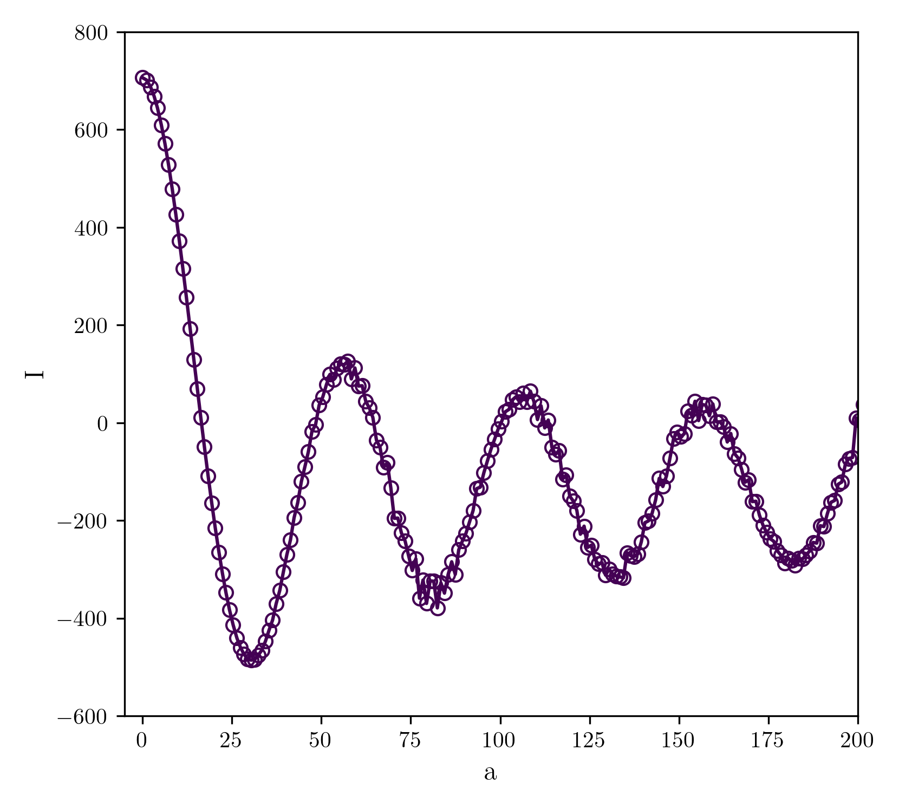

Functions written to extract the local wavenumber from a 3D wavefield
=====================================================================

K extraction 
------------

The principal function called to compute the local wavenumber k is "kextraction.kextractrion()"

.. autofunction:: kextraction.kextraction

radialavg2
----------
.. autofunction:: radialavg2.radialavg2

    Reconstruction of the Bessel function thanks to radialavg2 function following the example given by the function.
